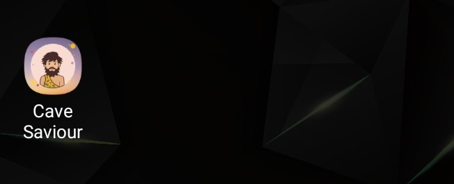
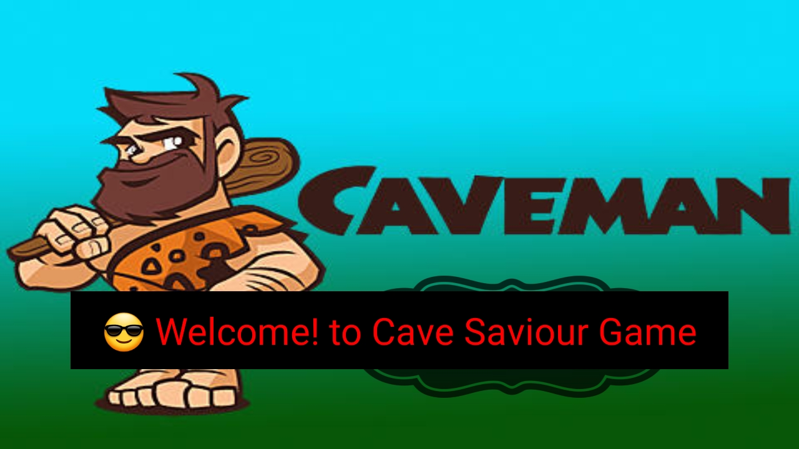
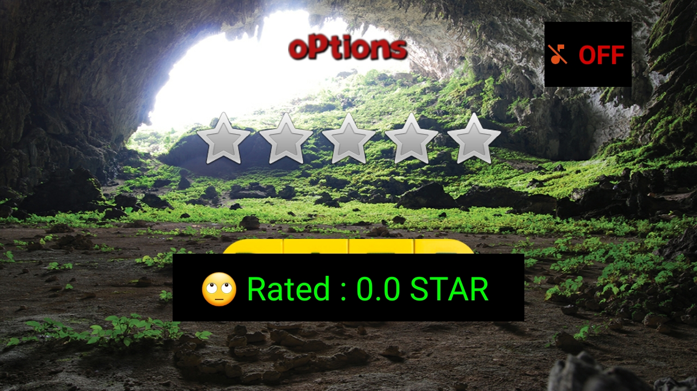
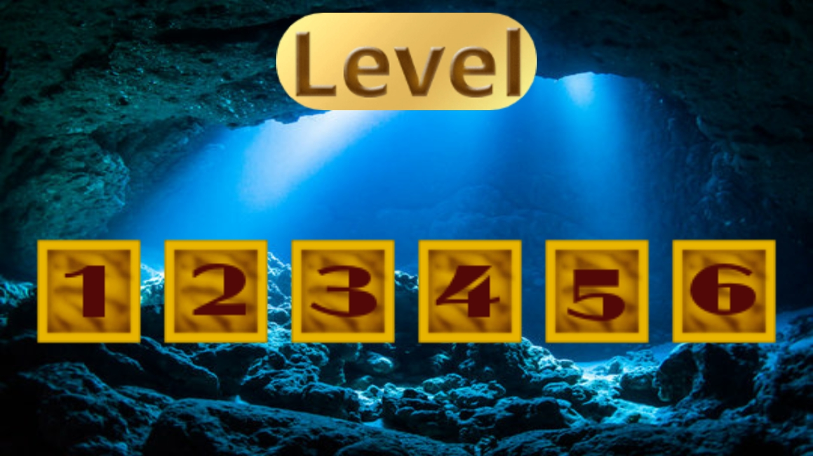
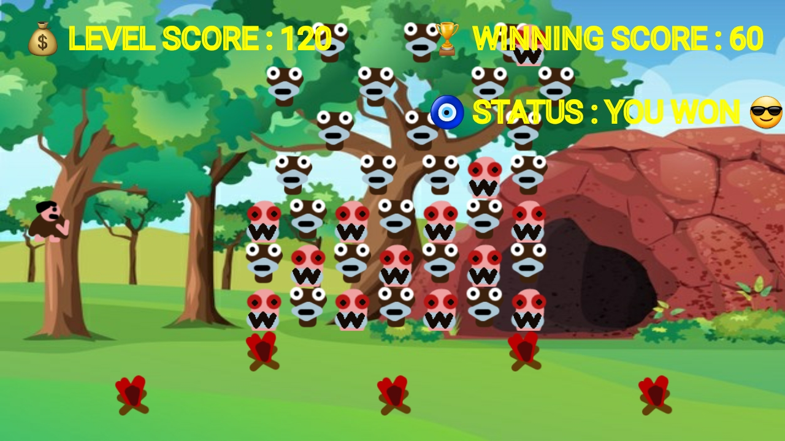
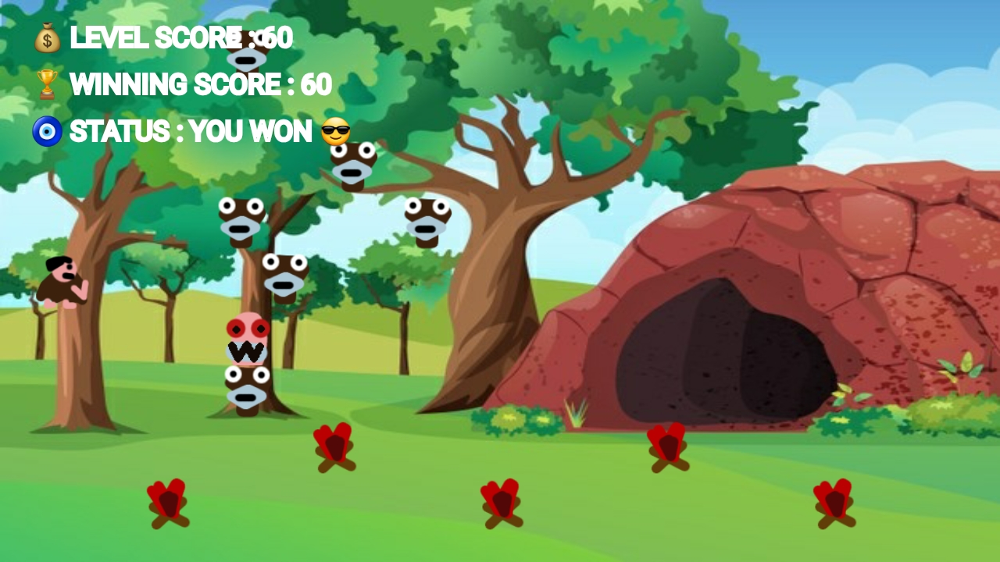
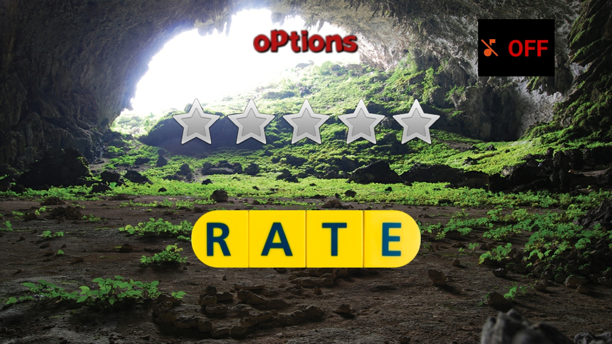
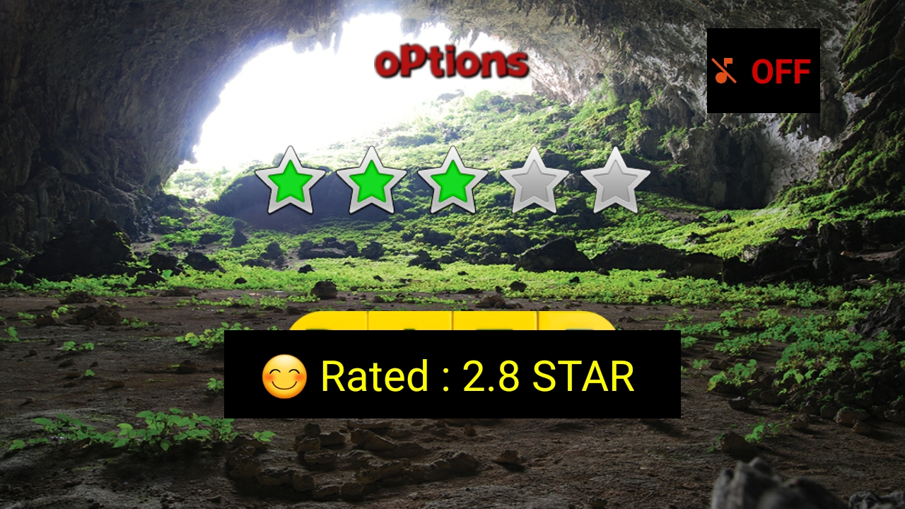
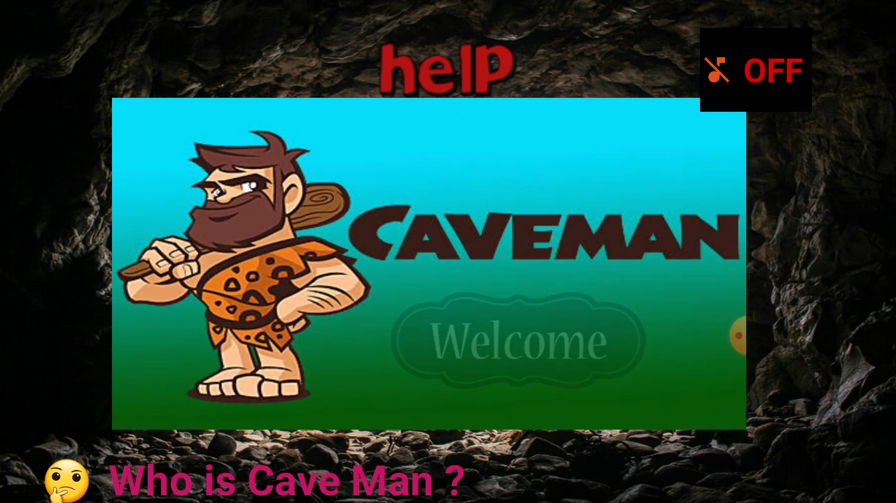
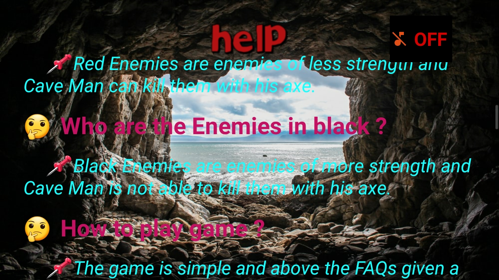

# ✔ CAVE MAN GAME - APP

### 1️⃣ A simple Cave Man Game(flash game) with Android Studio. 
### 2️⃣ Here SQLite data base is used to store the data of the player.(link to download SQLite DB Browser : https://sqlitebrowser.org/dl/  
# ✔ How to see Database Table :
### In Android Studio ,  
### 1️⃣ View -> Tool Windows -> Device File Explorer -> data -> data -> com.example.caveman -> databases -> SCORE.db 
### 2️⃣ Save As , this SCORE.db , somewhere when open DB Browser(SQLite), and open SCORE.db database in it. 
# ✔ Screenshots :

  
  
  
  
  
  
  
  
  
  
  
  
  
  
  
  
  

